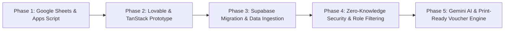

# 01. Project Vision, Origins & Evolution

The **Travel Tracker Dashboard** is an enterprise transit, accommodation, itinerary, and expense management platform built for modern business travel. It unifies multi-leg journeys (flights, trains, buses, hotels, and corporate events), real-time transit intelligence, zero-knowledge encrypted notes, multi-currency corporate spend tracking, and automated corporate expense vouchers into a responsive, mobile-first web application.

---

## 1. The Genesis: Why This Project Was Built

### 1.1 The Original State: The Google Sheets Workflow
Originally, company travel logistics, bookings, and expenses were managed through a shared **Google Sheet** (and associated Excel spreadsheets like `database.xlsx`). 

The early architecture attempted to render a web dashboard by having client-side JavaScript connect directly to Google Sheets using Apps Script webhooks or public CSV/JSON exports.

While Google Sheets was simple for initial data entry, it quickly collapsed under the demands of real-world corporate travel:

```
[ Traditional Google Sheets Setup ]
       │
       ├── ❌ Direct Client Fetch to Apps Script: Slow (2-6s latency), brittle, rate-limited.
       ├── ❌ CORS & Authentication Roadblocks: Web browsers frequently blocked direct cross-origin fetches.
       ├── ❌ Zero Row-Level Security: Every employee could see every other executive's hotel, flight costs, and notes.
       ├── ❌ Offline Blindspot: In flight or at airports with spotty roaming, travelers had zero access to tickets.
       ├── ❌ Data Schema Breakages: Slight manual formatting changes in Sheets broke frontend table parsers.
       └── ❌ Manual Expense Reconciliation: Accounting teams spent days matching paper receipts to bank cards.
```

### 1.2 The Pain Points That Led to Action
As captured in the project's early records and commit history:
1. **Data Display Failures**: Despite bookings being entered into Google Sheets, the dashboard frequently failed to fetch or render rows due to Apps Script execution limits, quota exhaustion, and unhandled CORS headers.
2. **Privacy and Sensitive Financials**: Travel vouchers contain sensitive financial data (sanctioned amounts, corporate card digits, personal bank account details, and salary/allowance records). In a shared spreadsheet, privacy was impossible.
3. **In-Flight & Airport Reality**: Travelers boarding aircraft or navigating international customs need instantaneous access to DigiYatra QR codes, boarding passes, and hotel vouchers without waiting for cloud sheets to load.
4. **Expense Chaos**: Employees on business trips had to retain physical paper receipts, manually calculate foreign exchange rates (e.g., converting USD/EUR/AED taxi receipts to INR), and spend hours after returning to create physical company expense vouchers.

---

## 2. The Strategic Evolution

To resolve these challenges, the project underwent a multi-stage transformation:



### Stage 1: UI Modernization (Lovable & TanStack Start)
- Transitioned from static HTML/Sheets scripts to a modern full-stack web framework built on **TanStack Start**, **React 19**, and **Tailwind CSS v4**.
- Established a mobile-first user experience featuring touch swipe navigation, haptic feedback, dark/light theme switching, and instant client-side tab transitions.

### Stage 2: Database Migration to Supabase PostgreSQL
- Extracted and cleaned legacy travel records from `database.xlsx` using an automated migration pipeline (`migrate-from-excel.ts`).
- Created a relational schema across 13 dedicated PostgreSQL tables hosted on **Supabase**.
- Bypassed the latency and fragility of Google Sheets, achieving sub-100ms query times.

### Stage 3: Zero-Knowledge Security & Enterprise Governance
- Introduced a custom cryptographic layer using the browser **Web Crypto API**:
  - Employee notes, reminders, and sensitive categories are encrypted using **AES-256-GCM** with keys derived via **PBKDF2 (150,000 iterations)**.
  - Even database administrators and Supabase storage backends only store encrypted ciphertext.
- Implemented **Role-Based Access Control (RBAC)**:
  - System Managers, Owners, HR, and Accounts can inspect enterprise-wide travel schedules and audit vouchers.
  - Standard employees are strictly restricted to itineraries and bookings explicitly assigned to them.
- Built an airline-aware name canonicalization algorithm to reconcile airline ticket name formats (e.g., `HEMAN/VISHWAS SURESH MR`) with system accounts (`Vishwas H`).

### Stage 4: AI & Transit Intelligence
- Integrated **Google Gemini Vision** (`gemini-3.1-flash-lite`) to automatically detect receipt boundaries, crop out background clutter, and extract bill amounts, dates, and categories.
- Integrated **Open-Meteo Weather API** to provide zero-latency destination forecasts based on airport codes (e.g., DEL, BOM, DXB, LHR) and flight arrival dates.
- Integrated **Frankfurter FX API** for automated historical and real-time foreign currency conversions into Indian Rupees (INR).
- Built one-click live tracking deep links for flights (IndiGo, Air India, Akasa, Emirates, etc.) and Indian Railways trains (IRCTC PNR status, live running tracking).

### Stage 5: Corporate Voucher & Accounting Automation
- Developed the **Corporate Travel Voucher Engine** ([TravelVoucherView.tsx](file:///home/embedded4/travel-tracker-dashboard/src/components/dashboard/TravelVoucherView.tsx)), replacing manual paper voucher workflows with print-ready, pixel-perfect digital vouchers adhering strictly to company accounting formats.
- Supports both individual traveler expense settlements and combined multi-participant group trip reconciliations.

---

## 3. Project Objectives & Core Pillars

| Pillar | Implementation | Rationale |
| :--- | :--- | :--- |
| **Reliability** | Supabase PostgreSQL + LocalStorage Snapshots | Guarantees instant load times and complete data availability even when offline or mid-flight. |
| **Privacy & Security** | Client-Side AES-256-GCM + Postgres RLS | Zero-knowledge architecture ensures personal travel notes and reminders remain unreadable to third parties. |
| **Operational Ease** | Gemini AI Vision + Automated FX Conversion | Eliminates manual expense entry; travelers photograph receipts and the system auto-crops and parses them. |
| **Compliance** | Print-Ready Standard Voucher Generation | Generates audit-ready vouchers matching company accounting rules, including advance deductions and sanctioned limits. |
| **Accessibility** | Multilingual i18n + Mobile PWA Gestures | Fully localized in English, Hindi, and Marathi, optimized for quick thumb navigation on mobile devices. |

---

## 4. Summary of Value Delivered

By moving from a fragmented Google Sheet to this integrated dashboard:
- **Travelers** have an intelligent pocket companion with live transit status, boarding passes, destination weather, and fast expense filing.
- **Managers & HR** have real-time visibility into who is traveling where, hotel allocations, and upcoming conference schedules.
- **Finance & Accounts** receive standardized, auto-calculated vouchers with linked receipt images and automatic currency conversion, slashing audit cycle times from days to minutes.
