# 02. Architecture & Tech Stack

This document details the architectural blueprint, technology decisions, directory anatomy, and execution environment of the **Travel Tracker Dashboard**.

---

## 1. High-Level System Architecture

The application is structured as a full-stack modern web platform built on **TanStack Start** and **React 19**, designed to run as an edge-ready server-rendered or client-hydrated application backed by **Supabase** and specialized third-party APIs.

```mermaid
flowchart TB
    subgraph Client ["Client Layer (Browser / Mobile PWA)"]
        UI["React 19 Components (Vite 7)"]
        State["TanStack Query Cache (5 min stale, 30 min GC)"]
        Router["TanStack Router (File-based routing)"]
        Crypto["Web Crypto AES-256-GCM (Client-side)"]
        Offline["Browser CacheStorage & LocalStorage Snapshot"]
    end

    subgraph SSR ["Server & Edge Layer"]
        ServerWrapper["src/server.ts (Nitro / Cloudflare Workers Entry)"]
        ErrorCapture["src/lib/error-capture.ts & error-page.ts"]
    end

    subgraph Backend ["Database & Storage (Supabase)"]
        Postgres["PostgreSQL Database (13 Tables)"]
        RLS["Row-Level Security Policies"]
        Storage["Supabase Storage ('documents' bucket)"]
        RPC["Postgres RPC ('login_secure', 'get_session_username')"]
    end

    subgraph ExternalAPIs ["External Intelligence Services"]
        Gemini["Google Gemini API (Vision / 3.1 Flash Lite)"]
        OpenMeteo["Open-Meteo Weather API (CORS, No Auth)"]
        Frankfurter["Frankfurter Currency FX API"]
        TransitPortals["Airline Trackers & IRCTC / RailYatri Portals"]
    end

    UI --> State
    UI --> Router
    UI --> Crypto
    UI --> Offline
    UI <--> ServerWrapper
    ServerWrapper --> ErrorCapture

    State <-->|"PostgREST API (Prefer: custom-auth-...)"| Postgres
    State <-->|"RPC Calls"| RPC
    Postgres --- RLS
    UI <-->|"Upload & Retrieve Tickets/Receipts"| Storage

    UI -->|"Receipt Boundary Crop & Parsing"| Gemini
    UI -->|"Airport & Destination Forecasts"| OpenMeteo
    UI -->|"Real-Time Currency Conversion to INR"| Frankfurter
    UI -->|"External Deep Links (PNR / Flight Status)"| TransitPortals
```



---

## 2. Technology Stack Breakdown

### 2.1 Core Framework & Language
- **React 19 (`19.2.0`)**: Modern React with concurrent rendering features, transitions, and component optimizations.
- **TypeScript (`5.8.3`)**: Strict static typing across routes, UI components, utilities, and API payloads.
- **TanStack Start (`1.167.50`)**: Full-stack framework combining SSR capabilities, hydration, and routing.
- **TanStack React Router (`1.168.25`)**: Type-safe, client-side routing with automatic code splitting and file-based route definitions (`src/routes`).
- **TanStack Query v5 (`5.83.0`)**: Asynchronous server-state management. Configured with:
  - `staleTime: 5 * 60_000` (5 minutes freshness).
  - `gcTime: 30 * 60_000` (30 minutes garbage collection).
  - `placeholderData: keepPreviousData` (zero layout shifts during background refreshes).

### 2.2 Bundling & Runtime
- **Vite 7 (`7.3.1`)**: Next-generation frontend build tool with instantaneous Hot Module Replacement (HMR).
- **Bun**: Ultra-fast JavaScript runtime and package manager used for local development (`bun --bun vite dev`).
- **Cloudflare Workers (`@cloudflare/vite-plugin 1.25.5` & `wrangler 2025-09-24`)**: Edge deployment configuration supporting high concurrency and low latency.
- **Nitro Engine (`nitro 3.0.260603-beta`)**: Server engine powering TanStack Start's edge runtime.

### 2.3 Styling & Design System
- **Tailwind CSS v4 (`4.2.1`)**: Next-generation CSS framework leveraging CSS-first configuration via `@theme inline`.
- **OKLCH Color Space**: Perceptually uniform color palette (`src/styles.css`) ensuring crisp contrasts across light and dark modes.
- **tw-animate-css (`1.3.4`)**: Micro-animations and slide transitions between tabs.
- **Radix UI Primitives**: Accessible, unstyled component foundations (Dialog, Popover, Dropdown Menu, Tabs, Select, Accordion, Checkbox, Slider, Tooltip).
- **Lucide React (`0.575.0`)**: Comprehensive icon set for transit modes, status badges, and action bars.
- **Sonner (`2.0.7`)**: Toast notification system for user actions and error handling.

### 2.4 Database, Storage & Backend
- **Supabase JS Client (`2.109.0`)**: PostgreSQL client interfacing with Supabase PostgREST endpoints and Storage APIs.
- **PostgreSQL Database**: Relational datastore containing 13 core tables, indexing, and foreign keys.
- **Row Level Security (RLS)**: Enforced database-level security policies controlled by user role and session tokens.
- **Supabase Storage**: Object storage bucket (`documents`) hosting PDF boarding passes, ticket images, and high-resolution expense receipts.

### 2.5 External Services & Intelligence
- **Google Gemini AI (`gemini-3.1-flash-lite`)**: Multimodal LLM leveraged for:
  - Computer vision receipt bounding box identification and automatic image cropping (`src/lib/receipt-crop.ts`).
  - Expense receipt data extraction (amount, date, merchant, category).
  - Audio and natural language parsing for quick-entry notes and reminders.
- **Open-Meteo Weather API**: Zero-API-key, CORS-enabled forecast service with airport-to-coordinate geocoding dictionary.
- **Frankfurter FX API**: Real-time and historical European Central Bank exchange rate service for automated currency conversion to INR.

### 2.6 Localization & Internationalization
- **i18next (`26.4.0`) & react-i18next (`17.0.12`)**: Complete internationalization framework with language detection and instant live translation between **English**, **Hindi (हिन्दी)**, and **Marathi (मराठी)**.

---

## 3. Directory & Codebase Anatomy

```
travel-tracker-dashboard/
├── .lovable/                 # Lovable configuration and project state
├── public/                   # Static assets, icons, manifest files
├── supabase/
│   └── schema.sql            # Initial PostgreSQL schema and realtime publications
├── src/
│   ├── components/
│   │   ├── auth/             # Authentication & credentials UI
│   │   │   ├── LoginPage.tsx          # Login form with instant password hashing
│   │   │   └── ChangePasswordModal.tsx# Password reset with note re-encryption
│   │   ├── dashboard/        # Feature-specific dashboard components
│   │   │   ├── FlightsList.tsx        # Flight cards with status & airline branding
│   │   │   ├── HotelsList.tsx         # Hotel stays with room assignments & maps
│   │   │   ├── TrainsList.tsx         # IRCTC train bookings with live tracker
│   │   │   ├── BusesList.tsx          # Bus bookings & ticket overview
│   │   │   ├── EventsTabContent.tsx   # Events, standing tours & notes
│   │   │   ├── DailyItinerary.tsx     # Chronological daily timeline
│   │   │   ├── MonthlyView.tsx        # Month-at-a-glance travel calendar
│   │   │   ├── SpendTabContent.tsx    # Expense tracking & vouchers
│   │   │   ├── TravelVoucherView.tsx  # Print-ready corporate voucher generator
│   │   │   ├── ConsolidatedReceiptsView.tsx # Receipt gallery, 3x3/4x3 print grids & auditor
│   │   │   ├── AddExpenseForm.tsx     # AI-assisted expense logging form with draft saving
│   │   │   ├── ExpenseUploadModal.tsx # UPI-style upload & celebratory success modal
│   │   │   ├── TravelSearchDialog.tsx # Universal travel omnisearch & command palette (Ctrl+K)
│   │   │   ├── AddButtonMenu.tsx      # Floating quick action menu (FAB)
│   │   │   ├── TopBar.tsx             # Dual timezone clock, countdown, search & profile
│   │   │   ├── FlightLiveTrackerModal.tsx # Airline flight status links
│   │   │   ├── TrainLiveTrackerModal.tsx  # RailYatri/ConfirmTkt PNR tracker
│   │   │   ├── WeatherForecastDialog.tsx  # 16-day Open-Meteo forecast modal
│   │   │   └── SettingsModal.tsx      # Gemini key, model & user administration
│   │   └── ui/               # Reusable Radix UI & design system primitives (Button, Dialog, Card, etc.)
│   ├── hooks/
│   │   ├── use-theme.tsx     # Dark / light theme management
│   │   ├── use-swipe.ts      # Mobile touch swipe gesture listener with form guardrails
│   │   └── use-mobile.tsx    # Viewport breakpoint detection
│   ├── lib/
│   │   ├── auth.ts           # Session storage, SHA-256 hashing, RPC login
│   │   ├── note-crypto.ts    # Web Crypto PBKDF2 + AES-256-GCM zero-knowledge engine
│   │   ├── supabase.ts       # Supabase client singleton with custom header injection
│   │   ├── dashboard-api.ts  # Master CRUD API service layer for all tables
│   │   ├── role-filter.ts    # RBAC logic & passenger name canonicalization
│   │   ├── expense-utils.ts  # Multi-currency spend calculations & voucher math
│   │   ├── expense-draft.ts  # Form draft persistence & recovery across sessions
│   │   ├── travel-search.ts  # Omnisearch index builder across all travel records
│   │   ├── weather-api.ts    # Airport coordinate mapping & Open-Meteo client
│   │   ├── receipt-crop.ts   # Gemini Vision receipt boundary cropper & normalizer
│   │   ├── offline-storage.ts# CacheStorage document cacher & offline snapshot
│   │   ├── i18n.ts           # Multilingual translation dictionary (EN, HI, MR)
│   │   └── error-capture.ts  # SSR catastrophic error interceptor
│   ├── routes/
│   │   ├── __root.tsx        # Root layout with meta tags & global styles
│   │   └── index.tsx         # Master dashboard controller & tab coordinator
│   ├── router.tsx            # TanStack Router instance creation
│   ├── start.ts              # TanStack Start client hydration entry point
│   ├── server.ts             # Cloudflare Workers / Nitro SSR entry wrapper
│   └── styles.css            # Tailwind v4 theme, OKLCH tokens, print styles
├── migrate-from-excel.ts     # Data ingestion pipeline from database.xlsx
├── secure_database.sql       # PostgreSQL RLS policies & login_secure RPC
├── package.json              # Project dependencies and npm scripts
├── vite.config.ts            # Vite 7 build configuration
└── wrangler.jsonc            # Cloudflare Workers deployment configuration
```

---

## 4. Key Architectural Patterns

### 4.1 Resilient Database Synchronization (`src/lib/dashboard-api.ts`)
To protect against schema divergence between development and production PostgreSQL tables, all booking update functions implement an automatic column reconciliation loop:

```typescript
// If a column is missing in the database schema (e.g., column dropped or renamed),
// dynamically strip the missing column from the payload and retry automatically.
while (error && (error.code === 'PGRST204' || error.message?.includes('Could not find the'))) {
  const match = error.message.match(/Could not find the '([^']+)' column/);
  if (match && match[1] && match[1] in payload) {
    delete payload[match[1]];
    const res = await getSupabase().from(table).update(payload).eq('id', params.sourceRow);
    error = res.error;
  } else {
    break;
  }
}
```
This guarantees that UI updates will never fail or lock out the user due to minor column naming differences.

### 4.2 Error-Resilient SSR Handling (`src/server.ts`)
TanStack Start uses Nitro/h3 under the hood, which can swallow in-handler runtime errors into generic JSON responses. 

`src/server.ts` intercepts these catastrophic 500 error responses before they reach the browser, extracts the real underlying stack trace via `src/lib/error-capture.ts`, logs it to server console output, and serves a styled, user-friendly recovery page (`src/lib/error-page.ts`).

### 4.3 Mobile-First Gesture Architecture (`src/hooks/use-swipe.ts`)
The dashboard is optimized for single-handed mobile operation:
- Horizontal touch swipes switch tabs in logical sequence (`flights` $\leftrightarrow$ `hotels` $\leftrightarrow$ `trains` $\leftrightarrow$ `buses` $\leftrightarrow$ `events` $\leftrightarrow$ `day` $\leftrightarrow$ `monthly` $\leftrightarrow$ `spend`).
- Triggers standard mobile haptic feedback (`navigator.vibrate?.(30)`) on tab change.
- Can be dynamically enabled or disabled in **Settings $\rightarrow$ Preferences**.
- Incorporates `data-no-swipe="true"` protection on input-heavy cards (such as expense forms) so pinch-zoom and horizontal scrolling within forms never trigger accidental tab switching.

### 4.4 Universal Travel Omnisearch Architecture (`src/lib/travel-search.ts`)
Rather than requiring travelers to manually check flights, hotels, trains, buses, events, and expenses in separate tabs:
- `buildTravelSearchHits()` builds an in-memory inverted search index across all loaded travel records.
- Keys indexed include airport codes, PNRs, airline flight numbers, hotel names, cities, train numbers, bus ticket references, merchant names, amounts, and corporate trip names.
- Powered by `TravelSearchDialog.tsx` with keyboard listener (`Ctrl+K` / `Cmd+K`) and TopBar search launcher.
- Results provide instant one-click deep navigation: sets the target tab, scopes the active trip, and clears interfering date filters.

### 4.5 Zero-Loss Form Draft Persistence (`src/lib/expense-draft.ts`)
Field staff and travelers frequently navigate away or switch tabs while logging receipts:
- Form fields (`amount`, `currency`, `date`, `category`, `paymentMethod`, `cardUsed`, `description`, `receiptFile`) are continuously serialized to `localStorage` with timestamping and Base64-encoded receipt caching.
- On return or page refresh, drafts are restored with a visible timestamp pill and a one-click "Discard" option.
- Drafts are atomically wiped only when an expense is successfully committed to Supabase.
