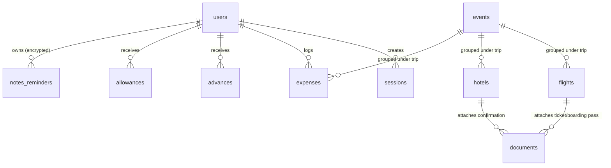

# 03. Database Schema & Security Model

This document provides a comprehensive specification of the **Supabase PostgreSQL** database schema, custom session authentication mechanism, Row-Level Security (RLS) policies, and the zero-knowledge client-side encryption architecture.

---

## 1. The 13 Database Tables

The database is composed of 13 relational tables hosted on Supabase PostgreSQL.



### 1.1 `users`
Stores employee profiles and authentication credentials.
| Column | Type | Constraints | Description |
| :--- | :--- | :--- | :--- |
| `username` | `TEXT` | `PRIMARY KEY` | Unique canonical username (e.g. `Vishwas H`, `Rajesh K`). |
| `name` | `TEXT` | `NOT NULL` | Full employee name in uppercase (e.g. `VISHWAS SURESH HEMAN`). |
| `password` | `TEXT` | `NOT NULL` | SHA-256 hashed password string. |
| `role` | `TEXT` | `NOT NULL` | Access role: `System Manager`, `Owner`, `HR`, `Accounts`, or `User`. |
| `email` | `TEXT` | `NULLABLE` | Corporate email address. |

### 1.2 `sessions`
Maintains active client sessions created upon successful login via the `login_secure` RPC.
| Column | Type | Constraints | Description |
| :--- | :--- | :--- | :--- |
| `token` | `TEXT` | `PRIMARY KEY` | UUIDv4 session token generated by `gen_random_uuid()`. |
| `username` | `TEXT` | `NOT NULL` | Associated employee username. |
| `role` | `TEXT` | `NOT NULL` | Cached user role for rapid RLS validation. |
| `createdat` | `TEXT` | `NOT NULL` | ISO 8601 creation timestamp. |
| `expiresat` | `TEXT` | `NOT NULL` | Session expiry timestamp (defaults to 30 days). |
| `lastactive` | `TEXT` | `NOT NULL` | Timestamp of most recent user interaction. |

### 1.3 `config`
Stores system-wide dynamic configuration values.
| Column | Type | Constraints | Description |
| :--- | :--- | :--- | :--- |
| `key` | `TEXT` | `PRIMARY KEY` | Configuration key name (e.g. `gemini_api_key`, `gemini_model`). |
| `value` | `TEXT` | `NULLABLE` | Value string (e.g. `AIzaSy...`, `gemini-3.1-flash-lite`). |

### 1.4 `flights`
Air travel bookings, itinerary timings, seat allocations, and costs.
| Column | Type | Description |
| :--- | :--- | :--- |
| `id` | `SERIAL PRIMARY KEY` | Auto-incrementing identifier. |
| `bookingstatus` | `TEXT DEFAULT 'Booked'` | Status: `Booked` or `Cancelled`. |
| `airline` | `TEXT` | Airline name and flight number (e.g. `IndiGo 6E 532`). |
| `fromcode` / `cityfrom` | `TEXT` | Origin airport 3-letter IATA code and city name (e.g. `PNQ`, `Pune`). |
| `tocode` / `cityto` | `TEXT` | Destination IATA code and city name (e.g. `DEL`, `Delhi`). |
| `departuredate` / `departuretime`| `TEXT` | Scheduled departure date (`DD/MM/YYYY`) and time (`HH:mm`). |
| `arrivaldate` / `arrivaltime` | `TEXT` | Scheduled arrival date (`DD/MM/YYYY`) and time (`HH:mm`). |
| `confirmationcode` | `TEXT` | 6-character airline PNR (e.g. `WZ4KLM`). |
| `duration` | `TEXT` | Flight duration (e.g. `2h 15m`). |
| `managelink` | `TEXT` | Direct airline web check-in or manage booking URL. |
| `assignedto` | `TEXT` | Comma-separated list of passenger names (e.g. `Vishwas H, Rajesh K`). |
| `amount` | `TEXT` | Flight booking cost in booking currency. |
| `currency` | `TEXT DEFAULT 'INR'` | Currency code (`INR`, `USD`, `EUR`, `AED`, etc.). |
| `amounttype` | `TEXT DEFAULT 'total'` | Cost division model: `total` (shared) or `perperson`. |
| `fxrate` | `TEXT` | Foreign exchange rate against INR applied at booking time. |
| `inrequivalent` | `TEXT` | Computed booking amount in Indian Rupees (INR). |
| `bookingdate` | `TEXT` | Date booking was made. |
| `trip` | `TEXT` | Name of corporate event or trip (e.g. `Hannover Messe 2026`). |
| `paymentmethod` | `TEXT` | Payment instrument: `Cash`, `Card`, `GPay`, or `Company Account`. |

### 1.5 `hotels`
Hotel accommodations, room allocations, check-in/out, and address details.
| Column | Type | Description |
| :--- | :--- | :--- |
| `id` | `SERIAL PRIMARY KEY` | Auto-incrementing identifier. |
| `bookingstatus` | `TEXT DEFAULT 'Booked'` | Status: `Booked` or `Cancelled`. |
| `hotelname` | `TEXT` | Name of hotel or stay property. |
| `address` / `city` | `TEXT` | Full street address and city. |
| `checkindate` / `checkoutdate` | `TEXT` | Check-in and check-out dates (`DD/MM/YYYY`). |
| `confirmationcode` | `TEXT` | Hotel reservation reference code. |
| `bookinglink` | `TEXT` | Direct link to reservation or hotel voucher. |
| `mapslink` | `TEXT` | Google Maps deep link for one-click navigation. |
| `latitude` / `longitude` | `TEXT` | Geolocation coordinates for map routing. |
| `phone` | `TEXT` | Front desk or concierge contact number. |
| `numberofrooms` | `TEXT` | Total rooms booked. |
| `roomassignments` | `TEXT` | Details of room allocations (e.g. `Room 304: Rajesh & Somning`). |
| `cancellationdeadline` | `TEXT` | Free cancellation cutoff date/time. |
| `bookedprice` | `TEXT` | Total hotel stay cost in booking currency. |
| `assignedto` | `TEXT` | Comma-separated list of occupants. |
| `currency` | `TEXT DEFAULT 'INR'` | Currency code. |
| `amounttype` | `TEXT DEFAULT 'total'` | Cost division model: `total` or `perperson`. |
| `fxrate` / `inrequivalent` | `TEXT` | Foreign exchange conversion rate and INR equivalent. |
| `trip` | `TEXT` | Associated trip or conference name. |

### 1.6 `trains`
Indian Railways (IRCTC) transit bookings.
| Column | Type | Description |
| :--- | :--- | :--- |
| `id` | `SERIAL PRIMARY KEY` | Auto-incrementing identifier. |
| `bookingstatus` | `TEXT DEFAULT 'Booked'` | `Booked` or `Cancelled`. |
| `trainnumber` / `trainname` | `TEXT` | 5-digit IRCTC train number (e.g. `12124`) and train name (e.g. `Deccan Queen`). |
| `fromcode` / `cityfrom` | `TEXT` | Origin railway station code and city (e.g. `PUNE`, `Pune Junction`). |
| `tocode` / `cityto` | `TEXT` | Destination station code and city (e.g. `CSMT`, `Mumbai CSMT`). |
| `departuredate` / `departuretime`| `TEXT` | Scheduled departure date and time. |
| `arrivaldate` / `arrivaltime` | `TEXT` | Scheduled arrival date and time. |
| `pnr` | `TEXT` | 10-digit IRCTC PNR number for live tracking. |
| `class` | `TEXT` | Travel class: `1A`, `2A`, `3A`, `CC`, `SL`, `EC`. |
| `assignedto` | `TEXT` | Assigned travelers. |
| `amount` / `currency` / `inrequivalent` | `TEXT` | Ticket cost and currency equivalent. |
| `trip` | `TEXT` | Associated trip name. |

### 1.7 `buses`
Intercity bus transit bookings.
| Column | Type | Description |
| :--- | :--- | :--- |
| `id` | `SERIAL PRIMARY KEY` | Auto-incrementing identifier. |
| `bookingstatus` | `TEXT DEFAULT 'Booked'` | `Booked` or `Cancelled`. |
| `busoperator` / `busnumber` | `TEXT` | Operator name (e.g. `VRL Travels`, `Zingbus`) and bus number. |
| `from_station` / `cityfrom` | `TEXT` | Boarding point name and city. |
| `to_station` / `cityto` | `TEXT` | Drop-off point name and city. |
| `departuredate` / `departuretime`| `TEXT` | Boarding date and time. |
| `arrivaldate` / `arrivaltime` | `TEXT` | Arrival date and time. |
| `ticketnumber` | `TEXT` | Bus ticket or booking reference. |
| `assignedto` | `TEXT` | Assigned travelers. |
| `amount` / `currency` / `inrequivalent` | `TEXT` | Ticket cost and currency equivalent. |
| `trip` | `TEXT` | Associated trip name. |

### 1.8 `events`
Company business trips, exhibitions, client visits, and conferences.
| Column | Type | Description |
| :--- | :--- | :--- |
| `id` | `SERIAL PRIMARY KEY` | Auto-incrementing identifier. |
| `eventname` | `TEXT` | Event name (e.g. `Electronica India 2026`, `General Travel`). |
| `startdate` / `enddate` | `TEXT` | Start and conclusion dates (`DD/MM/YYYY`). |
| `location` | `TEXT` | Venue city or exhibition center. |
| `type` | `TEXT` | Category: `Exhibition`, `Client Visit`, `Conference`, `Standing Tour`. |
| `ourrole` | `TEXT` | Company role: `Exhibitor`, `Attendee`, `Speaker`. |
| `notes` | `TEXT` | Logistics, booth numbers, and objectives. |
| `status` | `TEXT DEFAULT 'Booked'`| `Booked` or `Cancelled`. |

### 1.9 `expenses`
Itemized travel expenditures logged by employees on the road.
| Column | Type | Description |
| :--- | :--- | :--- |
| `id` | `SERIAL PRIMARY KEY` | Auto-incrementing identifier. |
| `timestamp` | `TEXT` | Creation timestamp. |
| `username` / `name` | `TEXT` | Username and full name of the employee who paid. |
| `trip` | `TEXT` | Associated trip name. |
| `category` | `TEXT` | `Food`, `Transport (Auto/Taxi)`, `Petrol/Diesel`, `Toll`, or `Misc. Expenses`. |
| `amount` / `currency` | `TEXT` | Amount paid and currency code. |
| `description` | `TEXT` | Expense description (e.g. `Dinner with client`, `Airport cab`). |
| `receipturl` | `TEXT` | Public URL to receipt image in Supabase Storage. |
| `receiptmimetype` | `TEXT` | MIME type (e.g. `image/jpeg`, `image/png`, `application/pdf`). |
| `fxrate` / `inrequivalent` | `TEXT` | Foreign exchange rate and calculated INR cost. |
| `paymentmethod` | `TEXT` | `Cash`, `Card`, or `GPay`. |
| `cardused` | `TEXT` | Specific corporate card if paid via Card (e.g. `XXXX 6002`). |
| `expensedate` | `TEXT` | Date expense occurred. |

### 1.10 `advances`
Company funds disbursed to travelers prior to departure.
| Column | Type | Description |
| :--- | :--- | :--- |
| `id` | `SERIAL PRIMARY KEY` | Auto-incrementing identifier. |
| `timestamp` | `TEXT` | Creation timestamp. |
| `username` / `name` | `TEXT` | Recipient employee username and name. |
| `trip` | `TEXT` | Associated trip name. |
| `amount` | `TEXT` | Advance amount in INR. |
| `method` | `TEXT` | Disbursal method: `Cash`, `Bank Transfer`, `Company Card`. |
| `givenby` | `TEXT` | Manager or Accounts personnel who issued the advance. |

### 1.11 `allowances`
Daily travel allowances (per diem) credited to employees for trip days.
| Column | Type | Description |
| :--- | :--- | :--- |
| `id` | `SERIAL PRIMARY KEY` | Auto-incrementing identifier. |
| `timestamp` | `TEXT` | Creation timestamp. |
| `username` / `name` | `TEXT` | Recipient employee. |
| `trip` | `TEXT` | Associated trip name. |
| `amount` | `TEXT` | Total daily allowance calculated for the trip in INR. |
| `method` | `TEXT` | Disbursal method. |
| `setby` | `TEXT` | HR or manager who approved the allowance. |

### 1.12 `notes_reminders`
Zero-knowledge encrypted personal notes and reminders.
| Column | Type | Description |
| :--- | :--- | :--- |
| `id` | `SERIAL PRIMARY KEY` | Auto-incrementing identifier. |
| `timestamp` | `TEXT` | Creation timestamp. |
| `username` / `name` | `TEXT` | Owner employee. |
| `type` | `TEXT` | `note` or `reminder`. |
| `text` | `TEXT` | **AES-256-GCM encrypted ciphertext** (Base64). |
| `duedate` / `duetime` | `TEXT` | Reminder deadline date and time. |
| `category` | `TEXT` | **AES-256-GCM encrypted ciphertext** (Base64). |
| `status` | `TEXT` | `Pending` or `Completed`. |

### 1.13 `documents`
Boarding passes, tickets, DigiYatra QR codes, and hotel vouchers.
| Column | Type | Description |
| :--- | :--- | :--- |
| `id` | `SERIAL PRIMARY KEY` | Auto-incrementing identifier. |
| `type` | `TEXT` | Booking type: `flight` or `hotel`. |
| `category` | `TEXT` | `ticket`, `boardingpass`, `confirmation`, or `digiyatra`. |
| `confirmationcode` | `TEXT` | Matching PNR or hotel reservation code. |
| `passengername` | `TEXT` | Passenger name. |
| `fileurl` | `TEXT` | Supabase Storage URL. |
| `uploadedat` | `TEXT` | Upload timestamp. |

---

## 2. Authentication & Session Architecture

Instead of standard Supabase Auth (which requires email confirmation and redirects), the platform implements an **atomic, custom session token mechanism** managed directly via PostgreSQL stored procedures and headers.

### 2.1 The `login_secure` Stored Procedure (`secure_database.sql`)
Authentication is executed inside an atomic `SECURITY DEFINER` function that verifies plain or hashed credentials and writes a session record in a single transaction:

```sql
CREATE OR REPLACE FUNCTION login_secure(p_username TEXT, p_password_plain TEXT, p_password_hash TEXT) 
RETURNS json AS $$
DECLARE
  v_user RECORD;
  v_token TEXT;
BEGIN
  -- 1. Find matching user by username or full name
  SELECT * INTO v_user 
  FROM public.users 
  WHERE (username ILIKE p_username OR name ILIKE p_username)
    AND (password = p_password_plain OR password = p_password_hash)
  LIMIT 1;
  
  IF NOT FOUND THEN
    RAISE EXCEPTION 'Invalid username or password';
  END IF;
  
  -- 2. Generate cryptographically strong UUIDv4 token
  v_token := gen_random_uuid()::text;
  
  -- 3. Record active session
  INSERT INTO public.sessions (token, username, role, createdat, expiresat, lastactive) 
  VALUES (
    v_token, 
    v_user.username, 
    v_user.role, 
    now(), 
    now() + interval '30 days',
    now()
  );
  
  RETURN json_build_object(
    'token', v_token,
    'username', v_user.username,
    'name', v_user.name,
    'role', v_user.role
  );
END;
$$ LANGUAGE plpgsql SECURITY DEFINER;
```

### 2.2 The PostgREST Header Injection Pattern (`src/lib/supabase.ts`)
To pass authentication context to Supabase's PostgREST API without modifying standard JWT configurations:
1. When a user logs in, the `token` is stored in browser `localStorage`.
2. The custom Supabase client factory (`getSupabase()`) injects this token into the standard HTTP `Prefer` header:
   ```typescript
   cachedClient = createClient(supabaseUrl, supabaseAnonKey, {
     global: {
       headers: {
         'Prefer': `custom-auth-${token}`
       }
     }
   });
   ```
3. PostgreSQL extracts this token on every request inside a `STABLE SECURITY DEFINER` function:
   ```sql
   CREATE OR REPLACE FUNCTION get_session_username() RETURNS TEXT AS $$
   DECLARE
     v_token TEXT;
     v_username TEXT;
   BEGIN
     v_token := current_setting('request.headers', true)::json->>'prefer';
     
     IF v_token LIKE '%custom-auth-%' THEN
       v_token := substring(v_token from position('custom-auth-' in v_token) + 12);
       v_token := split_part(v_token, ',', 1);
     ELSE
       RETURN NULL;
     END IF;

     SELECT username INTO v_username FROM public.sessions WHERE token = v_token;
     RETURN v_username;
   END;
   $$ LANGUAGE plpgsql STABLE SECURITY DEFINER;
   ```

---

## 3. Row-Level Security (RLS) Enforcement

All 13 tables enforce PostgreSQL Row-Level Security:

1. **User Management**:
   - `authenticated_can_read_users`: Authenticated users can read the user directory (required for assigning passengers).
   - `managers_can_manage_users`: Only users whose active session role is `System Manager` or `Owner` can insert, update, or delete users.
2. **Session Privacy**:
   - Users can only read and delete their own session rows.
3. **Data Isolation**:
   - Blanket authenticated policy (`authenticated_all_<table>`) grants query and mutation access to active session holders.
   - Fine-grained passenger visibility is applied deterministically on the client using `src/lib/role-filter.ts`.

---

## 4. Zero-Knowledge Client-Side Encryption (`src/lib/note-crypto.ts`)

Personal notes and reminders contain sensitive confidential observations, personal phone numbers, or private travel details. 

The application implements **Zero-Knowledge Encryption** using the browser's native **Web Crypto API**:

```
[ User Password + Username ]
           │
           ▼
[ PBKDF2 Key Derivation ]
   ├── Salt: "travel-dashboard-notes-{username}"
   ├── Hash: SHA-256
   └── Iterations: 150,000
           │
           ▼
[ AES-256-GCM Master Key ]
           │
     ┌─────┴──────────────────────────────────┐
     ▼                                        ▼
[ Encryption ]                           [ Decryption ]
  - Generate fresh 12-byte IV              - Extract 12-byte IV from prefix
  - Encrypt plaintext                      - Decrypt ciphertext with session key
  - Combine: [12-byte IV + Ciphertext]     - Display plaintext to user
  - Encode to Base64                       - Database only ever sees Base64
```

### Seamless Password Change Re-encryption
When a user updates their password in [ChangePasswordModal.tsx](file:///home/embedded4/travel-tracker-dashboard/src/components/auth/ChangePasswordModal.tsx):
1. `deriveKeyForReencryption(currentPassword, username)` generates the **old key**.
2. `deriveKeyForReencryption(newPassword, username)` generates the **new key**.
3. All existing notes belonging to the user are fetched, decrypted in-memory using the old key, immediately re-encrypted with the new key, and saved back to Supabase.
4. Only after all rows successfully re-encrypt does the system update the user's password hash in the database.
5. If re-encryption fails mid-flight, the transaction aborts and the password remains unchanged, preventing data corruption.

---

## 5. Passenger Name Canonicalization (`src/lib/role-filter.ts`)

Airlines frequently mangle traveler names on tickets and boarding passes (e.g., `HEMAN/VISHWAS SURESH MR` or `KULKARNI RAJESH VINAYAK`). 

`canonicalizePersonName()` uses an intelligent resolution algorithm:
1. Strips airline title noise (`MR`, `MRS`, `MS`, `DR`, `PROF`) and normalizes slashes `/` and hyphens `-`.
2. Matches against registered system users:
   - Evaluates combinations of first name + surname tokens regardless of word order.
   - Evaluates unique company first names or unique surnames.
3. Maps variations (e.g. `SOMNING GIRGAON` $\rightarrow$ `Somning G`, `HEMAN/VISHWAS` $\rightarrow$ `Vishwas H`).
4. Filters out corporate vendor strings accidentally entered in `assignedto` (e.g., `Keetronics Ltd`, `Urban Inn`, `Ashirwad`).
