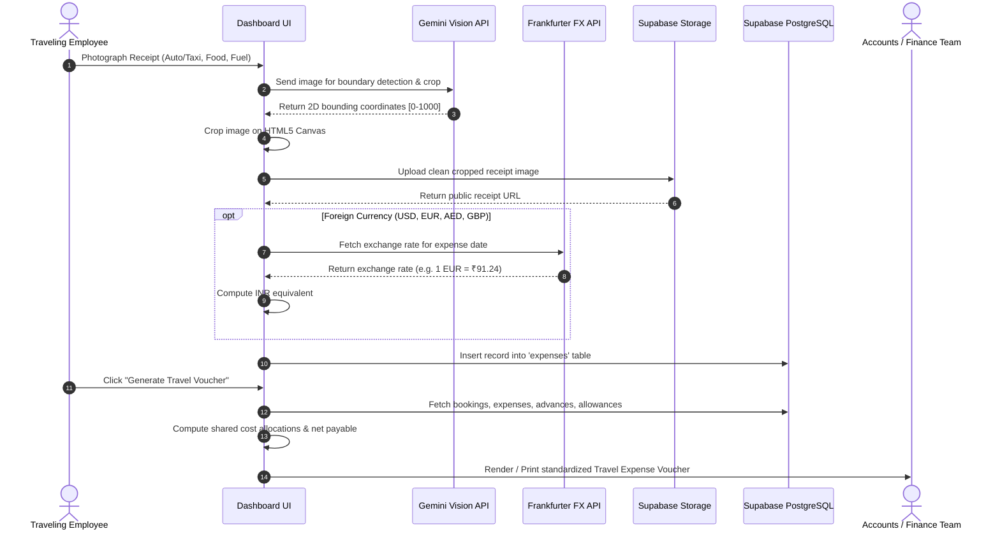

# 05. Corporate Spend & Travel Voucher Engine

One of the core capabilities of the **Travel Tracker Dashboard** is its end-to-end corporate spend management and automated voucher settlement engine. It replaces paper-based expense claims with audit-ready digital vouchers matching company accounting rules.

---

## 1. The Corporate Spend Lifecycle



---

## 2. Expense Logging & Categorization

### 2.1 Standard Expense Categories
All trip expenditures are classified into five standard categories:
1. **Food**: Meals, client dinners, refreshments.
2. **Transport (Auto/Taxi)**: Local autos, Uber/Ola rides, city transit.
3. **Petrol/Diesel**: Fuel purchases for corporate or personal vehicles.
4. **Toll**: Highway toll plaza payments (Fastag / cash).
5. **Misc. Expenses**: Printing, parking, SIM cards, entry passes.

### 2.2 Payment Methods & Corporate Card Tracking
Expenses can be logged under three payment channels:
- `Cash`
- `GPay` (UPI)
- `Card` (Corporate Credit Card)

When `Card` is selected, the UI requires the traveler to select the specific company card used:
- `XXXX XXXX XXXX 6002`
- `XXXX XXXX XXXX 0948`
- `XXXX XXXX XXXX 2001`
- `XXXX XXXX XXXX 7019`

This distinction is vital for accounting: **Card expenditures are paid directly by the company**, so they do not count toward amounts reimbursable to the employee in cash.

---

## 3. Automated Foreign Exchange (FX) Conversion

For international business trips (e.g., Dubai, Europe, Singapore, USA), expenses are frequently incurred in foreign currencies.

### 3.1 Frankfurter FX Integration (`src/lib/dashboard-api.ts`)
The dashboard integrates directly with the **Frankfurter Currency API** (`api.frankfurter.dev`), backed by the European Central Bank:

```typescript
export async function fetchFxRate(
  isoDate: string,
  fromCurrency: string,
): Promise<{ rate: number; dateUsed: string } | null> {
  if (!isoDate || !fromCurrency || fromCurrency.trim().toUpperCase() === "INR") return null;
  try {
    const url = `https://api.frankfurter.dev/v2/rates?date=${isoDate}&base=${fromCurrency.trim().toUpperCase()}&quotes=INR`;
    const res = await fetch(url);
    if (!res.ok) return null;
    const json = await res.json();
    // Resolves historical ECB conversion rate for the exact date of purchase
    let rate = Array.isArray(json) ? json[0].rate : json?.rates?.INR;
    return { rate, dateUsed: json?.date || isoDate };
  } catch {
    return null;
  }
}
```

### 3.2 Automated Invoicing
When an employee inputs `€ 45.00` with date `2026-05-14`, the dashboard fetches the historical rate for that date (e.g. `91.24`), calculates `₹ 4,105.80`, and stores both the original currency and INR equivalent in PostgreSQL.

---

## 4. Advances & Daily Allowances

Accurate trip reconciliation requires tracking pre-trip disbursements:

1. **Travel Advances (`advances` table)**:
   - Cash or bank transfers given to an employee prior to trip departure to cover operational expenses.
   - Example: ₹25,000 cash advance issued by Accounts.
2. **Daily Allowances (`allowances` table)**:
   - Per diem travel allowance earned by employees for every full or partial day of outstation travel.
   - Example: ₹1,500/day $\times$ 4 days = ₹6,000 daily allowance.

---

## 5. The Corporate Travel Voucher Generator (`TravelVoucherView.tsx`)

The **Travel Voucher** is the official financial reconciliation document used by company management and accounts.

### 5.1 Shared Booking Cost Allocation Algorithm (`src/lib/expense-utils.ts`)
When two or more employees travel together on a single flight or share a hotel room, booking costs must be fairly divided:

```typescript
export function sumBookingInr(
  records: Record<string, string>[],
  amountField: string,
  trip: string,
  username: string,
  name: string,
): number {
  let total = 0;
  for (const r of records) {
    if ((r.trip || GENERAL_TRAVEL).trim() !== trip) continue;
    if (!isAssignedToTrip(r, username, name)) continue;
    if ((r.bookingstatus || "").trim().toLowerCase() === "cancelled") continue;
    
    const raw = r[amountField] || "";
    if (!raw) continue;

    // Detect passenger sharing
    const assignees = splitPassengerList(r.assignedto);
    const assigneeCount = Math.max(assignees.length, 1);
    const isPerPerson = (r.amounttype || "total").trim().toLowerCase() === "perperson";
    
    // If "total": each person's share = amount / assigneeCount.
    // If "perperson": amount is already individual.
    const shareDivisor = isPerPerson ? 1 : assigneeCount;
    const n = parseAmount(r.inrequivalent || raw);
    
    if (!Number.isNaN(n)) total += n / shareDivisor;
  }
  return total;
}
```

### 5.2 Multi-Participant Aggregated Vouchers
In addition to individual employee vouchers, management can generate a **Combined Trip Voucher** representing the total corporate cost of a multi-employee group trip using multi-participant summation functions (`sumBookingInrMulti`, `sumExpensesByCategoryMulti`, `sumAdvancesMulti`, `sumAllowancesMulti`).

### 5.3 Voucher Accounting Matrix
The voucher calculates:
```
  [ TOTAL EXPENDITURES ]
  (+) Air Tickets
  (+) Lodging (Hotels)
  (+) Transport (Bus / Train)
  (+) Transport (Auto / Taxi)
  (+) Food
  (+) Petrol / Diesel
  (+) Toll
  (+) Daily Allowance
  (+) Misc. Expenses
  ───────────────────────────────────────
  (=) GRAND TOTAL EXPENSES (A)

  [ SETTLEMENT RECONCILIATION ]
  Grand Total Expenses (A)
  (-) Less: Paid Directly via Corporate Card
  (-) Less: Advance Disbursed by Company
  ───────────────────────────────────────
  (=) NET BALANCE REIMBURSABLE / REFUNDABLE
```

If Net Balance is positive, the company reimburses the employee. If negative (excess advance remaining), the employee refunds the remaining company cash.

### 5.4 Print-Ready Corporate Styling (`@media print`)
The voucher dialog incorporates custom print CSS rules:
- Suppresses top navigation bars, sidebar buttons, and background colors.
- Renders high-contrast black-and-white tabular borders conforming to the physical company voucher format.
- Prepares signature lines for:
  - *Employee Signature*
  - *Checked By (HR / Accounts)*
  - *Sanctioning Authority (Director / Managing Director)*

---

## 6. Consolidated Receipts Auditor & Print Engine (`ConsolidatedReceiptsView.tsx`)

The **Consolidated Receipts View** serves as an auditing gallery and tax-compliance print engine for corporate accounting review:
- Collects every receipt image attached to a specific trip.
- Shows side-by-side expense metadata: Date, Category, Amount in INR, Payment Method, Card Used, Description.
- Features interactive zoom and pan controls for auditing small or faint receipt text.
- Provides batch download controls to export all trip receipts as a consolidated package for tax filing.

### 6.1 Resilient Google Drive Media Pipeline
Historical company expense receipts hosted on Google Drive frequently fail to render due to Google's anti-hotlinking protections and broken `/preview` iframes. The platform implements a **4-tier candidate fallback pipeline**:
1. `https://drive.google.com/uc?export=view&id=${id}` (Direct export endpoint)
2. `https://lh3.googleusercontent.com/d/${id}` (High-speed Google UserContent CDN)
3. `https://drive.google.com/thumbnail?id=${id}&sz=w1000` (High-resolution thumbnail)
4. `https://drive.usercontent.google.com/download?id=${id}&export=view`
- **Referrer-Policy**: Images are tagged with `referrerPolicy="no-referrer"` to bypass cross-origin header rejections.
- **Eager Loading**: Images use `loading="eager"` to guarantee immediate rasterization during browser print rendering and PDF export.

### 6.2 Ultra-Compact Print Layouts (`3×3` & `4×3`)
Standard print formats often waste paper by placing single receipts per page inside thick borders:
- **Zero Bounding-Box Waste**: Strips padding, heavy bounding frames, and unnecessary text labels in print mode (`@media print`).
- **Interactive Print Density Switcher**:
  - **3×3 Layout**: Packs 9 to 12 receipt cards per A4 page (`print:grid-cols-3`).
  - **4×3 Dense Layout**: Packs 12 to 16 receipts per A4 page (`print:grid-cols-4`).
- **Toggleable Print Metadata**: An on-screen checkbox allows Accounts auditors to toggle receipt text descriptions on or off, maximizing receipt image area on physical printouts.
