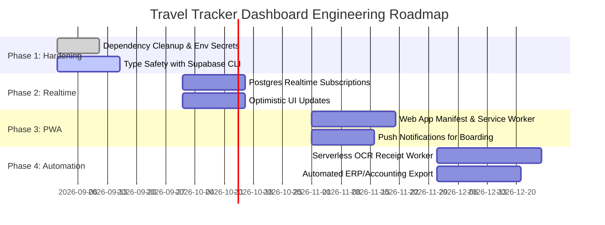

# 07. Codebase Audit & Strategic Roadmap

This document presents a critical architectural audit of the **Travel Tracker Dashboard**, highlighting technical strengths, operational vulnerabilities, and a phased roadmap for future engineering improvements.

---

## 1. Technical Strengths & Architectural Wins

1. **Zero-Knowledge Field Encryption**:
   - Implementing client-side AES-256-GCM encryption with PBKDF2 (150,000 iterations) via the native Web Crypto API is exceptional for an internal travel tool. Notes and reminders remain fully confidential even in the event of database credential exposure.
2. **Resilient Schema Column Reconciliation**:
   - The runtime `PGRST204` column reconciliation loop in `src/lib/dashboard-api.ts` prevents runtime application crashes when columns differ slightly across environments.
3. **Airport & Transit Intelligence**:
   - Pairing Open-Meteo's zero-auth weather service with an offline dictionary of airport IATA codes delivers instant weather updates without recurring API costs.
4. **Offline Document Resilience**:
   - Pre-caching tickets and boarding pass URLs into the browser's native `CacheStorage` ensures travelers can present DigiYatra QR codes and hotel reservations mid-flight.
5. **Print-Ready Corporate Accounting**:
   - The `TravelVoucherView` cleanly translates complex shared multi-traveler flight and hotel bookings into audit-ready corporate vouchers.

---

## 2. Audit Findings & Technical Debt

### 2.1 Security & Credential Hygiene
- **Hardcoded Fallback Credentials**:
  In [src/lib/supabase.ts](file:///home/embedded4/travel-tracker-dashboard/src/lib/supabase.ts#L4-L5), the Supabase project URL and anon JWT key are hardcoded as fallbacks if environment variables are missing.
  > [!WARNING]
  > While Supabase's `anon` key is designed to be public under Row-Level Security, embedding keys directly in source code creates compliance risks and complicates environment rotation. All keys should be loaded strictly via `.env.local` and Cloudflare Worker secrets.
- **Custom Auth Header vs Standards**:
  The application injects custom session tokens via `Prefer: custom-auth-<token>`. While effective at bypassing standard auth redirects, standardizing on the HTTP `Authorization: Bearer <token>` header is cleaner and more aligned with PostgREST conventions.
- **Dummy Password Reset**:
  Functions `requestPasswordReset` and `resetPasswordWithToken` in `src/lib/dashboard-api.ts` are currently dummy no-ops. Resetting forgotten passwords requires manual database intervention by an administrator.

### 2.2 Dependency & Bundle Bloat
- In [package.json](file:///home/embedded4/travel-tracker-dashboard/package.json#L59-L75), several heavy server-side packages are listed under production `dependencies`:
  - `puppeteer` (`^25.8.0`)
  - `playwright` (`^1.62.1`)
  - `xlsx` (`^0.18.5`)
  - `ws` (`^8.21.3`)
  > [!IMPORTANT]
  > These packages were used for diagnostic and scraping tests during development. Retaining them in production `dependencies` increases Docker build times and could accidentally inflate server bundle sizes. They should be moved to `devDependencies` or cleaned up.

### 2.3 Underutilized Realtime Publications
- In `supabase/schema.sql`, PostgreSQL Realtime publications are configured on all 10 core tables (`alter publication supabase_realtime add table ...`).
- However, the frontend currently relies entirely on TanStack Query polling (`staleTime: 5 * 60_000`) and manual refresh clicks.
- Integrating `supabase.channel()` listeners would enable instant, real-time updates across multiple devices whenever an expense is logged or a flight schedule changes.

### 2.4 TypeScript Strictness & Type Safety
- Several transit entities (especially `Train`, `Bus`, and parts of `Flight`) are typed as `Record<string, string>` or cast through `as unknown as any`.
- This increases the risk of subtle runtime typos (e.g., `departuredate` vs `departureDate`, `from_station` vs `fromcode`).

---

## 3. Phased Strategic Improvement Roadmap

### Phase 1: Security & Build Hardening
- **Remove Heavy Dependencies**: Purge `playwright`, `puppeteer`, and `xlsx` from production bundle dependencies.
- **Strict Environment Injection**: Remove hardcoded fallback JWT strings from `src/lib/supabase.ts` and ensure values are populated exclusively from Cloudflare Worker secrets or `.env.local`.
- **Database Type Generation**: Run `supabase gen types typescript` to generate strict TypeScript models directly from the PostgreSQL schema, eliminating `Record<string, string>` casting across `FlightsList`, `TrainsList`, and `BusesList`.

### Phase 2: Supabase Realtime & Optimistic UI
- **Live Event Subscriptions**: Wire `supabase.channel('public:all')` to TanStack Query cache invalidation so bookings added by an executive assistant appear instantly on the traveler's phone without requiring manual pull-to-refresh.
- **Optimistic Expense Logging**: Update `AddExpenseForm` to write the expense directly to the local cache immediately while the file upload and database insert finish in the background.

### Phase 3: Progressive Web App (PWA) & Native Capabilities
- **Full Web App Manifest**: Add standard PWA manifest (`manifest.webmanifest`) and app icons so users can "Add to Home Screen" on iOS and Android with full standalone display mode (no browser address bar).
- **Service Worker Background Sync**: Register a dedicated service worker to queue offline expenses and automatically upload them once network connectivity is re-established.
- **Push Notifications**: Integrate web push notifications to alert travelers 3 hours prior to flight departure or when train PNR status updates.

### Phase 4: Advanced Accounting & OCR Pipelines
- **Serverless Background OCR**: Move the Gemini Vision receipt boundary cropping and text extraction pipeline into a Supabase Edge Function triggered automatically upon receipt upload.
- **Automated ERP & Tally / Zoho Export**: Implement a one-click CSV / JSON export from `TravelVoucherView` that maps directly into corporate ERP systems (ERPNext, Zoho Books, or Tally) for automated expense journal voucher generation.
- **PDF Voucher Export**: Integrate client-side PDF generation (`jspdf` / `html2canvas`) to export vouchers as signed digital PDF files alongside the existing browser print engine.
